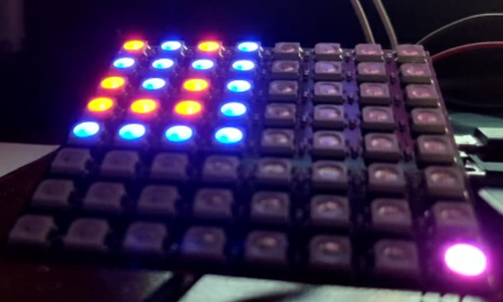
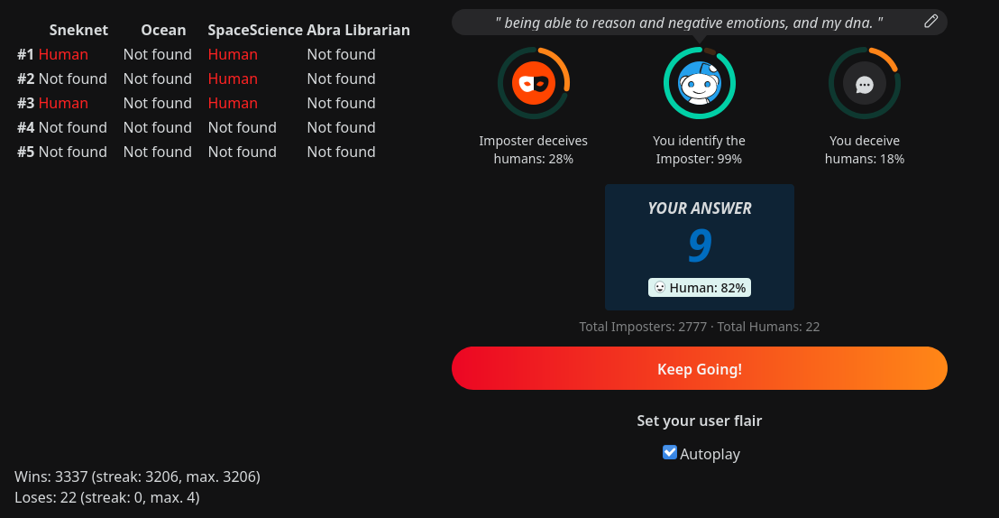

# About my Multisource r/Imposter userscript and the event as a whole

(If you want to see the interesting visual stuff, scroll down to the LEDs part with pictures.)

I started working on the script rather late on the 2nd of April. It was written mostly because for fun as I was bored, so not much care was put into any best practices. I didn't use version control for any of it (as it would just get in the way and slow me down), and the script was updated by manually copy pasting it to the extension's script editor (which did slow me down, but I didn't feel like figuring out how to edit it directly).

## Goals

The first problem it was trying to fix was the final answer usually being chosen randomly from the available options when data on more than one answer wasn't available. This often cost people their streaks. Instead, I chose to wait for the data to become available in some database, which usually happened within a few minutes.

The second problem was how most of the other scripts only used one or at most two data sources. I quickly realized that having as much data as possible would be beneficial, as the 5 answer choices were given out to users at random, so there was a decent chance that even if one database didn't have them saved, one of the others might. That was indeed the case.

## Data sources

Frequently the Snakeroom and SpaceScience datasets would complete each other. Most of the time the Snakeroom dataset already contained the data from Ocean Wave, but I believe there were still some instances where it didn't.

I also used the Abra Librarian API which usually came up with no answers, but I believe it helped make a choice or two early on. I believe that it was rather quickly abandoned, as I haven't found a single script that would submit data to it, and my attempts to do so resulted in responses that contained an empty JSON object (`{}`). Attempting to query the data after submitting it always yielded an empty answer.

The point about having as much data as possible might seem obvious, but the Snakeroom extension didn't use any of the SpaceScience data for the entire event, as its developers considered their data to often be inaccurate. Personally I found that the data returned by their API was perfectly fine, although it required a little bit of filtering to be useful.

There was one instance where bad data was returned from some API (which resulted in a deadlock as all answers were said to be human), but ultimately I never lost my streak due to that.

## Detectors

Rather quickly people figured out that the magic sauce behind Imposter is likely GPT-2, which happens to have a prediction network that attempts to determine whether some text was generated by GPT-2 or not. Of course some people decided to utilize it, with varying degrees of success.

Personally I implemented support for 2 detector APIs (Huggingface and Abra Detector), which both used different datasets, but I determined that the predictions made by them were not accurate enough for me to depend on, so they ended up being disabled most of the time.

I enabled them a few times while waiting for data, but since their confidence levels were relatively low (often under 75%), I never used any of it.

I'm not sure what exact datasets either of them used, but I don't regret not exploring this option. I prefered to depend on solid data instead of educated guessing.

If you want to, you can read more about the detector [here](https://github.com/openai/gpt-2-output-dataset/tree/master/detector).

## The LEDs, interface, and logs

You might also notice that the script connects to a WebSocket server with names referring to LEDs. The server was actually used for two purposes.

The first, as the names suggest, was to show the script status on an 8x8 LED matrix I had in my room.

Before I explain what it meant, I should probably show you how it looked. This was the LED array ([click here to see a video of it in action](https://youtu.be/EY8wwP7_dZ0?t=386)):

And this was the interface in the browser:

Both the table and the LEDs updated in real time as the data was fetched from the appropriate APIs. Red meant "human", green meant "imposter", blue meant "not found", and empty (or not lit up) meant that the data was still being retrieved. There was also a purple LED in the bottom right corner that lit up whenever the script was idle because there wasn't enough data and it was waiting to retrieve the data again in about 5 seconds.

Whenever the answer was correctly guessed the whole board would flash green. If the answer was wrong or the script entered an invalid state, the whole board would become red.

Fortunately, I only ever got to see the red once, and that was because of an exception that was raised either due to my connection temporarily going down, or because of an invalid response from Reddit. I never figured it out, as my browser froze when I attempted to view the network tab.

# The report exploit

Some people figured out that reporting the answers would roll you a new set of choices, allowing you to avoid having to guess. After this, you wouldn't be allowed to report anything for a minute.

Most people who got high on the leaderboards abused this. Personally, I chose not to do it and instead persevere with my strategy. I did once verify that it worked around 2000 on my streak, but it didn't feel right so I chose not to use it. I'm not sure if I'm the only person who got into the thousands without using the exploit, but I'm still content with my decision.

# Other notes

This is the first time I used the async/await syntax in a browser without any transpilation. There's no real reason I'm mentioning this, other than to express my happiness about today's state of JavaScript. It's good to see the language evolve into something usable.

# Final thoughts

Wow, I wrote a lot of stuff here. I guess I really was bored.

I'm not sure how to feel about the event. It wasn't bad, but it also wasn't great. Initially I chose to ignore it because it seemed boring, and I only got into it after messing around with other stuff and being done with that.

I mentioned yesterday how I feel that the Button wouldn't have been received as well as it was if it happened after Place and Robin. Those two set the bar pretty high. While the Button would probably still stay up at least as long as it did, I believe that people would get bored of it. It would've been considered lazy and unimaginative.

Still, overall I'm grateful to the Reddit staff for continuing the tradition and trying despite the circumstances. I would also like to thank everyone who contributed code and/or data during the event. None of us would be here without the rest of the community. I'm looking forward to next year's April Fools.

Thank you for reading.
